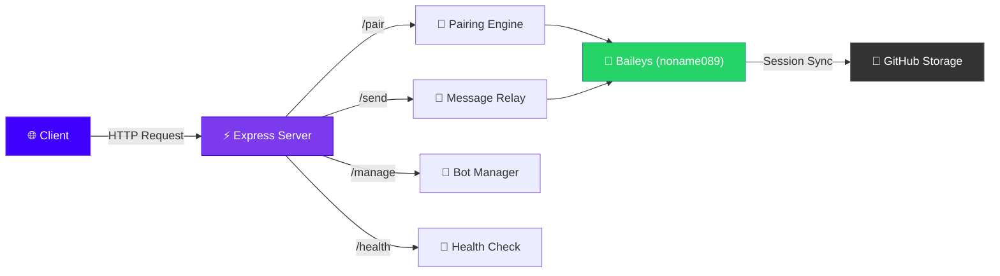
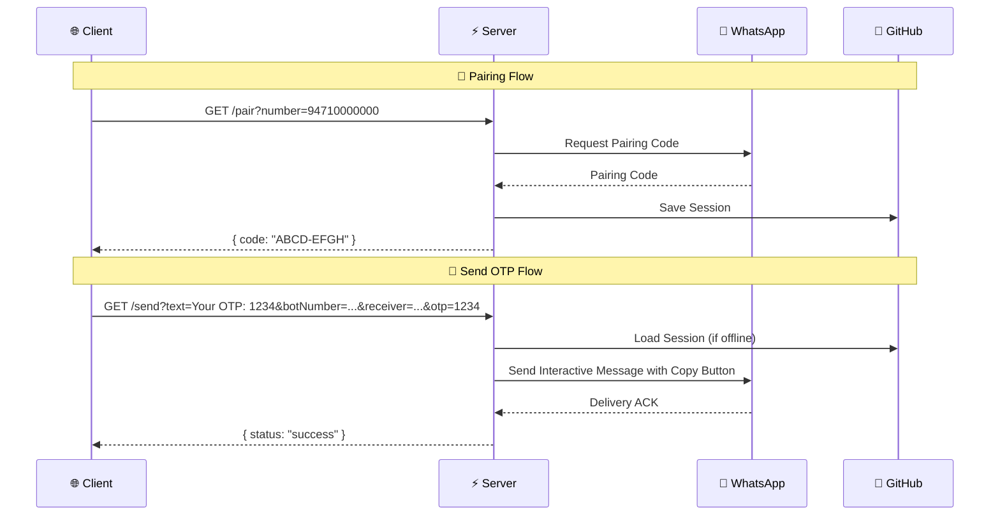

<div align="center">


<br/>


[](https://nodejs.org)
[](https://expressjs.com)
[](https://web.whatsapp.com)
[](https://vercel.com)


[](https://github.com/udmodz0)
[](https://github.com/udmodz0)
[](https://github.com/udmodz0)

<br/>


```
██╗░░░██╗██████╗░███╗░░░███╗░█████╗░██████╗░███████╗
██║░░░██║██╔══██╗████╗░████║██╔══██╗██╔══██╗╚════██║
██║░░░██║██║░░██║██╔████╔██║██║░░██║██║░░██║░░███╔═╝
██║░░░██║██║░░██║██║╚██╔╝██║██║░░██║██║░░██║██╔══╝░░
╚██████╔╝██████╔╝██║░╚═╝░██║╚█████╔╝██████╔╝███████╗
░╚═════╝░╚═════╝░╚═╝░░░░░╚═╝░╚════╝░╚═════╝░╚══════╝
```

</div>

---


##  &nbsp;About

> **WhatsApp OTP API** is a high-performance, serverless-ready authentication system that delivers OTP codes directly through WhatsApp messages. Built with a custom Baileys fork (`noname089`), sessions are securely stored on GitHub — making it cloud-native and infinitely scalable.

<div align="center">

| 🧩 Feature | 📝 Description |
|:---:|:---|
| 🔐 **Pairing API** | Link WhatsApp accounts via pairing code |
| 📨 **OTP Delivery** | Send OTP with one-tap copy button |
| 💬 **Custom Messages** | Send any formatted text message |
| 🤖 **Bot Management** | Delete or check status of linked bots |
| ☁️ **GitHub Sessions** | Persistent sessions stored on GitHub |
| 🌐 **Multi-Platform** | Deploy on Vercel, VPS, or locally |
| 🔒 **HTTPS Ready** | Auto-generated self-signed certs for local dev |
| 🧠 **Smart Reconnect** | Auto-reconnects saved bots on startup |

</div>


##  &nbsp;Architecture




##  &nbsp;API Endpoints

<details>
<summary><b>📲 1. Request Pairing Code</b></summary>
<br/>

```http
GET /pair?number={phone_number}
```

| Parameter | Type | Description |
|:---|:---|:---|
| `number` | `string` | **Required.** Phone number (digits only) |

**✅ Success Response:**
```json
{
  "status": "success",
  "code": "WORK-CODE"
}
```

**⚠️ Already Paired:**
```json
{
  "status": "already_authenticated",
  "message": "This bot is already paired to api."
}
```
</details>

<details>
<summary><b>💬 2. Send Message / OTP</b></summary>
<br/>

```http
GET /send?text={message}&botNumber={from}&receiver={to}
```

| Parameter | Type | Description |
|:---|:---|:---|
| `text` or `msg` | `string` | **Required.** Message content |
| `botNumber` | `string` | **Required.** Sender bot number |
| `receiver` | `string` | **Required.** Destination number |
| `otp` | `string` | *Optional.* OTP code — adds a **📋 Copy OTP** button |

**✅ Success Response:**
```json
{
  "status": "success",
  "message": "Message sent"
}
```

> 💡 **Pro Tip:** When `otp` is provided, the message is sent as an interactive view-once message with a native copy-code button!
</details>

<details>
<summary><b>🔧 3. Manage Bot</b></summary>
<br/>

```http
GET /manage?number={phone_number}&action=delete
```

| Parameter | Type | Description |
|:---|:---|:---|
| `number` | `string` | **Required.** Bot phone number |
| `action` | `string` | **Required.** Action to perform (`delete`) |

**✅ Success Response:**
```json
{
  "status": "success",
  "message": "Bot {number} deleted."
}
```
</details>

<details>
<summary><b>💚 4. Health Check</b></summary>
<br/>

```http
GET /health
```

**✅ Response:**
```json
{
  "status": "ok",
  "bots": [
    {
      "number": "94710000000",
      "status": "open",
      "lastUpdate": "2026-03-24T14:00:00.000Z"
    }
  ]
}
```
</details>


## ⚙️ Tech Stack

<div align="center">

<table>
<tr>
<td align="center" width="120">

<br/><b>Node.js</b>
<br/><sub>≥ 22</sub>
</td>
<td align="center" width="120">

<br/><b>Express</b>
<br/><sub>v4.18</sub>
</td>
<td align="center" width="120">

<br/><b>Octokit</b>
<br/><sub>Session Store</sub>
</td>
<td align="center" width="120">

<br/><b>Vercel</b>
<br/><sub>Serverless</sub>
</td>
</tr>
</table>

</div>


## 🚀 Deployment

<details>
<summary><b>🖥️ Local Development</b></summary>
<br/>

```bash
# 1. Clone the repository
git clone https://github.com/udmodz0/auth-wa-api.git
cd auth-wa-api

# 2. Install dependencies
npm install

# 3. Configure environment
#    Create config.env or .env with:
#    GITHUB_REPO_URL=https://github.com/your-user/your-repo
#    GITHUB_SECRET_KEY=ghp_your_personal_access_token

# 4. Start the server
npm start
```

> 🔒 **HTTPS Note:** Local development uses a self-signed certificate. Click **Advanced → Proceed to localhost** in your browser to bypass the warning.

</details>

<details>
<summary><b>🟣 Deploy to Vercel (Serverless)</b></summary>
<br/>

1. Connect your repository to [Vercel](https://vercel.com)
2. Vercel auto-detects `vercel.json` & `api/index.js`
3. Set **Environment Variables** in the Vercel dashboard:

| Variable | Value |
|:---|:---|
| `GITHUB_REPO_URL` | `https://github.com/user/repo` |
| `GITHUB_SECRET_KEY` | `ghp_your_token` |
| `NODE_ENV` | `production` |

4. Deploy! 🚀

> ⚡ **Note:** Vercel is serverless — bots connect on-demand when an API call is made.

</details>

<details>
<summary><b>☁️ Deploy to VPS / Node.js Host</b></summary>
<br/>

1. Ensure **Node.js 22+** is installed
2. Clone the repository
3. Set environment variables:

```bash
export GITHUB_REPO_URL="https://github.com/user/repo"
export GITHUB_SECRET_KEY="ghp_your_token"
export NODE_ENV="production"
export PORT=8080
```

4. Install & start:

```bash
npm install
npm start
```

5. The server auto-connects all saved bots from GitHub on startup ✅

</details>


## 📁 Project Structure

```
auth-wa-api/
├── 📄 api/
│   └── index.js          # 🧠 Core server — all routes & bot logic
├── 📄 vercel.json         # ⚡ Vercel serverless config
├── 📄 package.json        # 📦 Dependencies & scripts
├── 📄 .gitignore          # 🚫 Ignores sessions, env files, node_modules
└── 📄 README.md           # 📖 You are here!
```


## 📦 Dependencies

<div align="center">

| Package | Purpose |
|:---|:---|
| `noname089` | 🔌 Custom Baileys fork for WhatsApp Web API |
| `express` | ⚡ Fast HTTP server framework |
| `@octokit/rest` | 🐙 GitHub API client for session storage |
| `cors` | 🌐 Cross-origin request handling |
| `dotenv` | 🔧 Environment variable management |
| `pino` | 📊 Ultra-fast JSON logger |
| `selfsigned` | 🔒 Self-signed SSL certificate generation |
| `gradient-string` | 🎨 Beautiful console gradients |
| `chalk` | 🖌️ Terminal string styling |
| `axios` | 🌐 HTTP client |
| `adm-zip` | 🗜️ ZIP file handling |
| `cheerio` | 🔍 HTML parser |
| `jimp` | 🖼️ Image processing |
| `megajs` | ☁️ Mega cloud storage |
| `mongodb` | 🍃 MongoDB driver |
| `moment-timezone` | 🕐 Timezone-aware dates |

</div>


## ⚠️ Environment Variables

| Variable | Required | Description |
|:---|:---:|:---|
| `GITHUB_REPO_URL` | ✅ | Full URL to your GitHub session storage repo |
| `GITHUB_SECRET_KEY` | ✅ | GitHub Personal Access Token (PAT) with repo access |
| `NODE_ENV` | ❌ | Set to `production` for HTTP mode (default: HTTPS with self-signed cert) |
| `PORT` | ❌ | Server port (default: `8080`) |


## 🔐 How It Works




<div align="center">

## 👨‍💻 Creator

<a href="https://github.com/udmodz0">
  
</a>

<br/>

<a href="https://github.com/udmodz0">
  
</a>

<br/><br/>


### ⭐ Star this repo if you found it useful!

<br/>

> 🚫 **This is a FREE API — Do NOT sell it.**
> 
> Made with 💜 by **UDMODZ**

<br/>


<br/>


</div>
